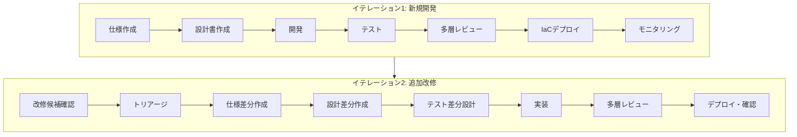
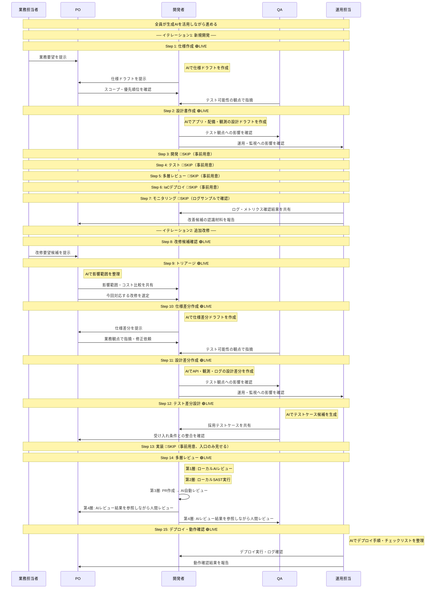
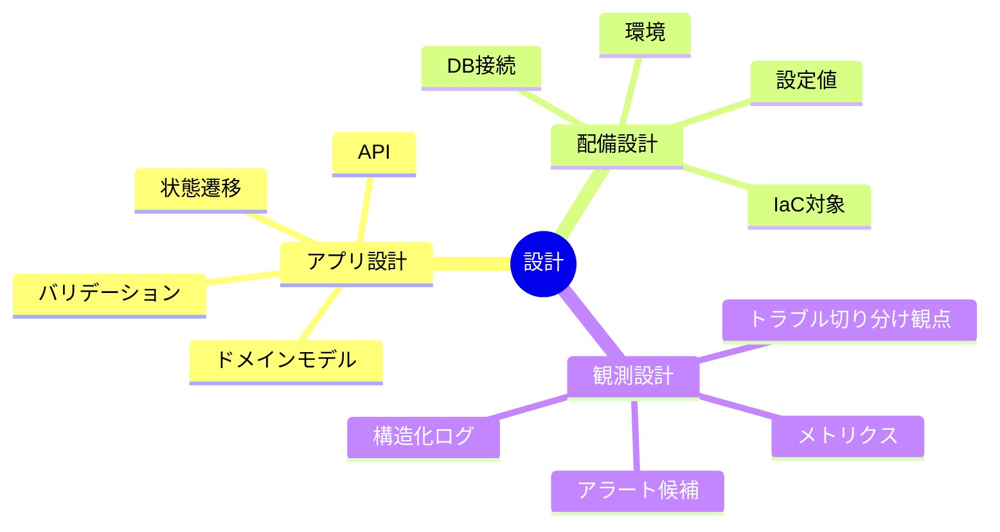
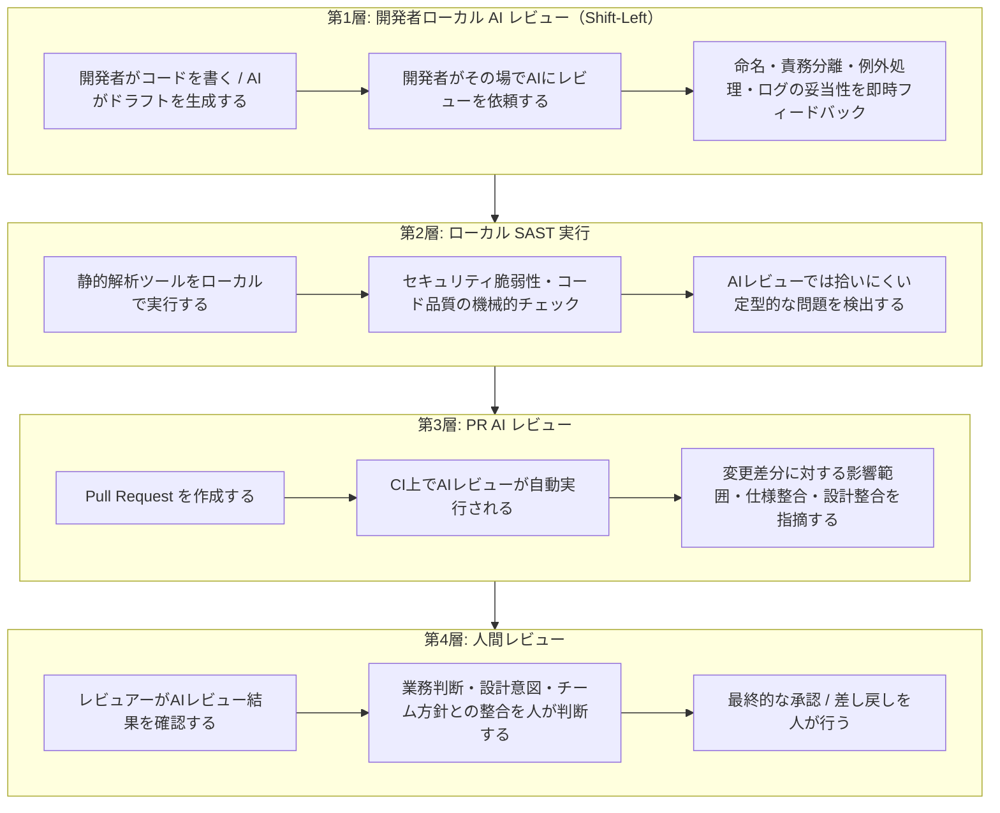

# お客様向けライブデモ シナリオガイド
**テーマ:** 生成AI前提の小規模 Java アプリ開発を、仕様駆動かつアジャイルに進める流れを体感いただくデモ
**題材:** 社内向け備品購入申請アプリ
**想定時間:** 60分

### バッジの見方

| バッジ | 意味 |
|---|---|
| 🔴 **SKIP** | デモでは事前用意した成果物を見せ、作業過程はスキップする |
| 🟢 **LIVE** | デモでライブ実演する |

---

## 1. このデモでお見せすること

このデモでは、単に「AIでコードを早く書く」ことではなく、
**複数の役割を持つメンバーが、生成AIで各成果物のドラフト作成を高速化しつつ、レビューを通じて品質を高めながら開発を進める流れ** をお見せします。

特に、次の点をご確認いただけます。

- 要望から仕様書を素早く作る進め方
- 設計に **配備（デプロイ）** と **観測（モニタリング）** を最初から含める考え方
- 実装・テスト・IaCデプロイ・ログ確認までの一連の流れ
- 改修要望が出た後に、いきなりコード修正せず **トリアージ → 仕様差分 → 設計差分 → テスト差分** の順で進める流れ
- 生成AI時代の **多層レビュープロセス**（開発者ローカルAIレビュー → SAST → PR AIレビュー → 人間レビュー）

---

## 2. デモ全体像



---

## 3. 登場人物と役割

> **前提:** 生成AIは独立した役割ではなく、全員が自分の業務で活用するツールです。
> 各ペルソナが **AIのサポートを受けながら** 成果物を作成し、人間同士でレビュー・合意形成を行います。

| 役割 | 主な責務 | デモでの関わり | AIの活用例 |
|---|---|---|---|
| 業務担当者 | 現場要望の提示、業務妥当性確認 | 要求提示、仕様レビュー | 要望の整理・言語化 |
| PO / 業務責任者 | スコープ決定、優先順位付け、受け入れ判断 | 仕様レビュー、改修トリアージ | 影響範囲の比較整理、受け入れ条件のドラフト |
| 開発者 | 設計・実装・技術妥当性確認 | 設計レビュー、開発、差分設計 | 設計ドラフト、コード生成、ローカルAIレビュー |
| QA担当 | テスト観点整理、仕様の穴の検出 | 受け入れ条件確認、追加テスト設計 | テストケース候補の生成、境界値の洗い出し |
| 運用担当 | デプロイ・運用・観測観点の確認 | IaCデプロイ、ログ確認、運用影響確認 | IaC雛形生成、チェックリスト整理、ログ分析 |

---

## 4. 題材アプリの概要

**備品購入申請アプリ** を題材にします。

### MVP機能
- 申請者が備品購入申請を登録できる
- 承認者が承認 / 却下できる
- 申請一覧を確認できる
- 却下時は理由を必須にする
- 高額申請（例: 5万円超）には注意表示を出す

### なぜこの題材か
- 業務フローが分かりやすい
- 承認フロー、入力チェック、検索、監視など複数観点を含めやすい
- 小規模アプリとして1時間デモに収まりやすい
- 改修要望を自然に追加しやすい
- 「動いているものに手を入れる」という現実に近い開発を再現できる

---

## 5. デモの進め方

> **前提:** 生成AIは特定の誰かの専用ツールではなく、全員がそれぞれの業務で活用します。
> 以下の図では、各ペルソナが **自分の担当領域でAIを使いながら** 成果物を作成し、人間同士でレビュー・合意形成を行う流れを示します。



### この図のポイント
- 生成AIは独立した登場人物ではなく、**各ペルソナの業務に組み込まれたツール** として描いている
- 人間同士のやり取り（レビュー・合意形成・意思決定）がプロセスの軸である
- イテレーション1とイテレーション2で **同じプロセス構造が繰り返される** ことを示している

---

# 6. 各ステップの詳細

---

# イテレーション1: 新規開発

---

## Step 1. 仕様作成 🟢 LIVE

### このステップの目的
現場の要望を、開発・テスト・運用で共有できる **仕様** に変換します。

### 関与するペルソナ
| ペルソナ | この工程での役割 |
|---|---|
| 業務担当者 | 現場の要望を提示する |
| 開発者 | AIを使って仕様ドラフトを作成する |
| PO | スコープと優先順位をレビューし、MVP範囲を確定する |
| QA担当 | テスト可能な粒度かをレビューする |

### 具体的にやること
1. 業務担当者が要望を提示する
   例:
   - 備品購入を申請したい
   - 承認 / 却下を行いたい
   - 却下理由は申請者に伝えたい
   - 高額申請は目立たせたい

2. 開発者がAIを使って仕様の初稿を作る
   - ユーザーストーリー
   - 業務ルール
   - 受け入れ条件
   - 曖昧点の候補

3. 人がレビューする
   - PO: スコープと優先順位を確認
   - 開発者: 実装可能な粒度か確認
   - QA: テスト可能か確認

### AIへの入力例
```
以下の業務要望から、仕様書のドラフトを作成してください。

要望:
- 備品購入を申請したい
- 承認 / 却下を行いたい
- 却下理由は申請者に伝えたい
- 高額申請は目立たせたい

以下を含めてください:
- ユーザーストーリー一覧
- 業務ルール
- 受け入れ条件
- 曖昧な点・確認が必要な点
```

### 主なアウトプット
- `requirements.md`
- `acceptance-criteria.md`

### ここでお見せするポイント
- AIは仕様の初稿を速く作れる
- ただし仕様確定は人のレビューで行う
- 最初から完璧ではなく、レビューで整える

---

## Step 2. 設計書作成 🟢 LIVE

### このステップの目的
仕様を、開発・運用に使える **設計** に落とし込みます。
このデモでは、設計はアプリ内部だけでなく **配備設計** と **観測設計** も含みます。

### 関与するペルソナ
| ペルソナ | この工程での役割 |
|---|---|
| 開発者 | AIを使ってアプリ・配備・観測の設計ドラフトを作成する |
| PO | 仕様から逸脱していないかをレビューする |
| QA担当 | テストに落とし込める粒度かをレビューする |
| 運用担当 | 実際に運用可能な設計かをレビューする |

### 具体的にやること
1. 開発者がAIに設計ドラフトを依頼する
2. AIが次のドラフトを生成する
   - ドメインモデル
   - API設計
   - 状態遷移
   - バリデーション設計
   - 配備方針・IaC対象
   - ログ項目・メトリクス候補

3. 関係者がレビューする
   - PO: 仕様から逸脱していないか
   - QA: テストに落とし込めるか
   - 運用担当: 実際に運用可能か

### AIへの入力例
```
以下の仕様書（requirements.md）に基づいて、設計書のドラフトを作成してください。

以下の3つの観点を含めてください:

1. アプリ設計
   - ドメインモデル、API設計、状態遷移、バリデーション

2. 配備設計
   - 実行環境、IaC対象、設定値管理、DB接続

3. 観測設計
   - 構造化ログ項目、メトリクス、アラート候補、トラブル切り分け観点
```

### 設計で含める観点


### 主なアウトプット
- `design-app.md`
- `design-deployment.md`
- `design-observability.md`

### ここでお見せするポイント
- デプロイや監視は後付けではなく、設計時に考慮する
- AIは設計のドラフトを速く出せる
- 運用・QAのレビューを通じて、実用的な設計に整える

---

## Step 3. 開発 🔴 SKIP

### このステップの目的
設計に沿って、まず動くMVPを構築します。

### 関与するペルソナ
| ペルソナ | この工程での役割 |
|---|---|
| 開発者 | AIを使って実装ドラフトを生成し、レビュー・修正して品質を整える |

### 具体的にやること
1. 開発者がAIに実装ドラフトを依頼する
2. AIが次を生成する
   - Spring Boot雛形
   - Entity / Controller / Service / Repository
   - バリデーションコード案
   - 単体テストの初稿
   - ログ出力雛形

3. 開発者がレビュー・修正する
   - 責務分離
   - 例外処理
   - 命名
   - ログの妥当性

### 実装する範囲
- 申請登録
- 申請一覧
- 承認
- 却下
- 却下理由必須
- 高額申請の注意表示

### 主なアウトプット
- Javaアプリ
- 単体テストの初版

### デモ上の進め方
> 事前に構築済みのアプリと単体テストを用意し、完成物を見せる形で進める。
> 「このMVPは、仕様と設計をAIドラフト + レビューで整理した上で、AIで実装の初稿を生成し、開発者がレビュー・修正して構築しました」と説明する。

### ここでお見せするポイント
- AIがコードの初稿を作る
- 人がレビューし、品質と責務を整える
- ログは後付けではなく最初から実装に含める

---

## Step 4. テスト 🔴 SKIP

### このステップの目的
実装が「動く」だけでなく、「合意した仕様通り」であることを確認します。

### 関与するペルソナ
| ペルソナ | この工程での役割 |
|---|---|
| QA担当 | AIを使ってテスト観点の初稿を作成し、優先順位を整理する |
| 業務担当者 | 業務観点でテストシナリオの妥当性をレビューする |
| PO | 受け入れ条件との整合をレビューする |
| 開発者 | 技術的なテスト実現性をレビューする |

### 具体的にやること
1. QA担当がAIにテスト観点の初稿を依頼する
2. AIが次を出す
   - 正常系
   - 異常系
   - 境界値
   - 権限制御
   - 受け入れテスト候補

3. QAが整理する
4. 業務担当者 / PO / 開発者がレビューする

### テストで確認する例
- 金額が0以下なら登録不可
- 却下理由がないと却下不可
- 承認済みの挙動
- 高額判定の境界値
- 一般ユーザーは承認できない

### 主なアウトプット
- `test-scenarios.md`
- テストコード

### デモ上の進め方
> 事前に用意したテストシナリオとテストコードを見せる形で進める。

### ここでお見せするポイント
- AIはテストケース候補を大量に出せる
- QAが優先順位と採用可否を判断する
- テストは品質保証だけでなく、仕様の穴を見つける役割も持つ

---

## Step 5. 多層レビュー 🔴 SKIP

### このステップの目的
実装とテストに対して、4層のレビューを実施します。

### 関与するペルソナ
| ペルソナ | この工程での役割 |
|---|---|
| 開発者 | 第1層（ローカルAIレビュー）・第2層（SAST）を実行し、第3層（PR AIレビュー）をトリガーする |
| PO | 第4層（人間レビュー）で業務妥当性を判断する |
| QA担当 | 第4層（人間レビュー）でテスト観点の充足を確認する |

### 具体的にやること
1. 第1層: 開発者がローカルでAIレビューを実行する
2. 第2層: 開発者がローカルでSASTを実行する
3. 第3層: PR作成時にCI上でAIレビューが自動実行される
4. 第4層: 人間がAIレビュー結果を参照しながらレビューする

> 多層レビュープロセスの詳細は [補足A. 生成AI時代の多層レビュープロセス](#補足a-生成ai時代の多層レビュープロセス) を参照。

### 主なアウトプット
- レビュー済みコード
- 承認済みPR

### デモ上の進め方
> イテレーション1のレビュー過程はスキップし、イテレーション2のStep 14で多層レビューをライブ実演する。
> 「イテレーション1でも同じレビュープロセスを経ています」と説明する。

---

## Step 6. IaCによるデプロイ 🔴 SKIP

### このステップの目的
設計済みの配備方針に基づき、IaCで環境を構成し、アプリを展開します。

### 関与するペルソナ
| ペルソナ | この工程での役割 |
|---|---|
| 運用担当 | AIを使ってIaC雛形・デプロイ手順を作成し、IaCを適用する |
| 開発者 | 配備構成がアプリ設計と整合しているかを確認する |

### 具体的にやること
1. 運用担当がAIにIaC雛形や手順ドラフトを依頼する
2. AIが次を出す
   - Terraform雛形
   - デプロイ手順
   - 環境差分整理
   - チェックリスト

3. 運用担当と開発者が確認する
4. IaCを適用し、アプリを起動する

### 主なアウトプット
- `infra/`
- デプロイ実行結果
- 起動済みアプリ

### デモ上の進め方
> 事前にデプロイ済みの環境を使用する。IaCの構成ファイルは見せるが、適用過程はスキップする。

### ここでお見せするポイント
- 配備を手作業でなくコード化する
- アプリ設計と配備設計がつながっている
- AIで雛形は作れるが、適用判断は人が行う

---

## Step 7. モニタリング・ログ確認 🔴 SKIP

### このステップの目的
アプリを出した後に、**何が起きているかを観測できる状態** を確認します。

### 関与するペルソナ
| ペルソナ | この工程での役割 |
|---|---|
| 運用担当 | ログ・メトリクスを確認し、異常傾向を把握する。AIを使ってログ要約を行う |
| 開発者 | APIの応答時間やエラー傾向など技術的な観点で確認する |
| PO | 改善候補の優先順位を判断する材料として確認結果を受け取る |

### 具体的にやること
1. テストデータやリクエストを流す
2. ログや基本メトリクスを確認する
3. 性能低下や異常傾向を把握する
4. 次の改善候補を認識する

### 想定する確認内容
- 一覧表示APIの応答時間
- エラー件数
- 高額申請の件数
- 承認 / 却下処理の失敗有無
- requestId / userId / action の追跡

### 主なアウトプット
- ログ確認結果
- 改善候補の認識材料

### デモ上の進め方
> デモでは実際のデプロイを行わないため、事前に用意した **ログサンプル** を使用する。
> 観測設計（design-observability.md）で定義した項目がログにどう出力されるかを、サンプルデータで示す。
>
> 見せ方の例:
> - 構造化ログ（JSON）のサンプルを画面に表示し、requestId / userId / action で追跡できることを示す
> - 高額申請の件数や承認/却下の処理結果がログから読み取れることを示す
> - AIにログサンプルを渡して要約・異常検出させるデモを行う

### ここでお見せするポイント
- 監視は「出した後に気合で見る」のではなく、設計済みの観測ポイントに沿って行う
- AIはログや異常傾向の要約を支援できる
- ただし改善方針の優先順位は人が決める

---

# イテレーション2: 追加改修

---

## Step 8. 改修候補の確認 🟢 LIVE

### このステップの目的
既に上がっている改修候補を整理し、次の反復で扱う対象を決める準備をします。

### 関与するペルソナ
| ペルソナ | この工程での役割 |
|---|---|
| 業務担当者 | 現場からの改修要望を提示する |
| PO | バックログ候補を整理し、次の反復で検討する範囲を絞る |

### デモ上の前提
- 要望収集そのものは既に済んでいる
- バックログ候補が複数存在する
- 今回はその中から1つ選ぶ

### 例として用意する候補
- 高額申請だけ一覧で絞り込みたい
- 却下理由を一覧で見たい
- 一覧表示の性能を改善したい

### 主なアウトプット
- 改修候補一覧

### ここでお見せするポイント
- 現実の開発では、改修要求の発生そのものより、その後の整理と優先順位付けが重要
- デモでは、その後段の意思決定プロセスを重点的にお見せする

---

## Step 9. トリアージ 🟢 LIVE

### このステップの目的
改修候補を比較し、今回の反復で何を扱うか決めます。

### 関与するペルソナ
| ペルソナ | この工程での役割 |
|---|---|
| PO | AIを使って各候補の影響範囲を整理し、業務価値の観点で優先順位を判断する |
| 開発者 | 技術コスト・実装難易度の観点でフィードバックする |
| QA担当 | テスト負荷・回帰リスクの観点でフィードバックする |
| 運用担当 | 運用影響（ログ・メトリクス・インフラ変更）の観点でフィードバックする |

### 具体的にやること
1. POがAIで各候補の影響範囲を整理する
   - 実装コスト
   - テスト影響
   - API差分の有無
   - 運用影響（ログ・メトリクスへの影響）

2. 人が判断する
   - PO: 業務価値
   - 開発者: 技術コスト
   - QA: テスト負荷
   - 運用担当: 運用影響

3. 今回対応する候補を決定する

### AIへの入力例
```
以下の改修候補について、既存の設計書（design-app.md, design-observability.md）を踏まえて
影響範囲を比較してください。

候補A: 高額申請だけ一覧で絞り込みたい
候補B: 却下理由を一覧で見たい
候補C: 一覧表示の性能を改善したい

各候補について以下を整理してください:
- API変更の有無と範囲
- DB変更の有無
- テスト追加の規模感
- ログ・メトリクスへの影響
- 実装コスト（S/M/L）
```

### 今回選ぶ候補
**高額申請だけ一覧で絞り込みたい**

### 主なアウトプット
- `change-triage.md`

### ここでお見せするポイント
- AIは比較材料の整理が得意
- 最終判断は業務価値と実装コストのバランスで行う
- 改修は思いつきで着手せず、整理して選ぶ

---

## Step 10. 仕様差分の作成 🟢 LIVE

### このステップの目的
選定された改修を、正式な **仕様差分** に変換します。

### 関与するペルソナ
| ペルソナ | この工程での役割 |
|---|---|
| 開発者 | AIを使って仕様差分のドラフトを作成する |
| PO | 業務要件としての妥当性をレビューし、曖昧な点を指摘する |
| QA担当 | テスト可能な粒度か、境界値が明確かをレビューする |

### 具体的にやること
1. 開発者がAIで仕様差分の初稿を生成する
   - requirement差分
   - acceptance criteria差分
   - 業務ルール差分

2. 人がレビューする
   - PO: 業務要件として妥当か
   - QA: テスト可能か
   - 開発者: 曖昧さがないか

### AIへの入力例
```
既存仕様（requirements.md）に対して、以下の改修を仕様差分として整理してください。

改修内容: 一覧画面で高額申請のみ絞り込みできるようにする

以下を含めてください:
- 追加するユーザーストーリー
- 業務ルールの追加・変更
- 受け入れ条件の追加
- 既存仕様への影響（変更が必要な箇所）
- 曖昧な点・確認が必要な点
```

### AIがドラフトに含める仕様の例
- 一覧画面で高額申請のみ絞り込みできる
- 高額申請の定義は5万円超
- 条件未指定時は従来通り全件表示
- 結果0件でも正常応答

### AIドラフトの指摘・修正シーン（意図的に見せる）
AIの初稿に対して、レビューで以下のような指摘が入るシーンを再現する:
- **PO:** 「高額の閾値は将来変わる可能性がある。設定値として外出しできるようにしておきたい」
- **QA:** 「『5万円超』は50,001円以上か、50,000円を含むのか。境界値の定義が曖昧」
- **開発者:** 「絞り込みはクエリパラメータかフロント側フィルタか。仕様として明記すべき」

→ AIドラフトを修正し、仕様を確定する

### 主なアウトプット
- `requirements-v2.md`
- `acceptance-criteria-v2.md`

### ここでお見せするポイント
- 改修でも先に仕様を更新する
- AIが差分仕様を素早く作る
- **AIの初稿には曖昧さや漏れが含まれる。だからこそレビューが必要**
- 生成AI時代でも、コード修正前の仕様明文化は重要

---

## Step 11. 設計差分の作成 🟢 LIVE

### このステップの目的
仕様差分を、実装可能な設計差分に落とし込みます。

### 関与するペルソナ
| ペルソナ | この工程での役割 |
|---|---|
| 開発者 | AIを使って設計差分（API・Repository・バリデーション）を作成する |
| QA担当 | テスト観点への影響をレビューする |
| 運用担当 | ログ・監視・メトリクスへの影響をレビューする |

### 具体的にやること
1. 開発者がAIで設計差分を生成する
   - API差分
   - Repository差分
   - バリデーション追加
   - ログ差分
   - メトリクス影響

2. 人がレビューする
   - 開発者: 既存設計との整合
   - QA: テスト観点への影響
   - 運用担当: ログ・監視への影響

### AIへの入力例
```
以下の仕様差分（requirements-v2.md）と既存設計（design-app.md, design-observability.md）を
踏まえて、設計差分を整理してください。

以下を含めてください:
- API変更（エンドポイント、パラメータ、レスポンス）
- Repository層の変更
- バリデーション追加
- ログ出力の追加・変更
- メトリクスへの影響
- 既存コードへの影響範囲
```

### 設計差分の例
- `GET /requests?highAmountOnly=true`
- 高額判定ロジックの共通化（閾値は設定値として外出し）
- 一覧取得ログに `highAmountOnly` パラメータを追加
- 絞り込み利用率のメトリクス追加

### 主なアウトプット
- `design-app-v2.md`
- `design-observability-v2.md`

### ここでお見せするポイント
- 改修は仕様差分だけでなく設計差分も必要
- 運用・観測への影響も同時に見直す
- AIは差分整理を速く行える

---

## Step 12. テスト差分の設計 🟢 LIVE

### このステップの目的
実装前に、追加改修で必要なテスト観点を整理します。

### 関与するペルソナ
| ペルソナ | この工程での役割 |
|---|---|
| QA担当 | AIを使ってテストケース候補を生成し、採用ケースを決定する |
| 開発者 | テストの技術的実現性を確認する |
| PO | 受け入れ条件との整合をレビューする |

### 具体的にやること
1. QAがAIで追加テスト候補を生成する
2. QAが採用ケースを決める
3. 開発者とPOが確認する

### AIへの入力例
```
以下の仕様差分（requirements-v2.md）と設計差分（design-app-v2.md）を踏まえて、
追加テストケースを整理してください。

以下の観点を含めてください:
- 正常系テスト
- 異常系テスト
- 境界値テスト
- 回帰テスト（既存機能への影響確認）
- 受け入れテスト候補
```

### テストケースの例
- `highAmountOnly=true` で5万円超のみ返る
- 50,000円ちょうどは含まれない（境界値）
- 条件未指定時は従来の一覧と同じ（回帰確認）
- 0件でも正常応答
- 不正なパラメータ値でのエラーハンドリング
- 閾値設定値を変更した場合の挙動

### 主なアウトプット
- `test-scenarios-v2.md`

### ここでお見せするポイント
- 改修では、実装前に追加テスト観点を整理する
- 回帰影響を早期に意識する
- AIは候補を出し、人が採否を決める

---

## Step 13. 実装 🔴 SKIP

### このステップの目的
仕様差分・設計差分・追加テスト差分が整った状態で、改修実装に入ります。

### 関与するペルソナ
| ペルソナ | この工程での役割 |
|---|---|
| 開発者 | AIを使って差分実装を生成し、ローカルAIレビュー（第1層）とSAST（第2層）を実行する |

### 具体的にやること
1. 開発者がAIで差分実装案を生成する
2. 開発者が変更対象を確認する
3. 開発者がローカルでAIレビュー（第1層）を実施する
4. 開発者がローカルでSAST（第2層）を実行する

### 主なアウトプット
- 差分コード
- 変更対象ファイル一覧
- 追加テストコード

### デモ上の進め方
> 実装プロセスの入口（AIへの指示と生成結果の確認）を見せた上で、完成物は事前に用意したものを使用する。
> **ポイントは「実装がどう進むか」ではなく「実装前に何が整っているか」と「実装後にどうレビューするか」**

### ここでお見せするポイント
- 追加改修でも、いきなりコードに入らない
- spec → design → test を更新してから実装する
- 生成AIは差分実装の立ち上がりを速くする

---

## Step 14. 多層レビュー 🟢 LIVE

### このステップの目的
実装済みの差分コードに対して、4層のレビューを実施します。

### 関与するペルソナ
| ペルソナ | この工程での役割 |
|---|---|
| 開発者 | 第1層（ローカルAIレビュー）・第2層（SAST）を実行し、PRを作成して第3層（PR AIレビュー）をトリガーする |
| PO | 第4層（人間レビュー）で業務妥当性・設計方針との整合を判断する |
| QA担当 | 第4層（人間レビュー）でテスト観点の充足・回帰リスクを確認する |

> 多層レビュープロセスの詳細は [補足A. 生成AI時代の多層レビュープロセス](#補足a-生成ai時代の多層レビュープロセス) を参照。

### 第1層: 開発者ローカル AI レビュー（Shift-Left）

開発者がコード変更後、その場でAIにレビューを依頼する:

```
以下のコード変更をレビューしてください。

変更の背景:
- 仕様: requirements-v2.md
- 設計: design-app-v2.md

レビュー観点:
- 仕様との整合性
- 命名規約
- 責務分離
- 例外処理の妥当性
- ログ出力の漏れ
- テスタビリティ
```

AIがローカルで即時フィードバックを返す例:
- 「閾値のハードコーディングを検出。設計では設定値として外出しする方針」
- 「絞り込み条件のログ出力が漏れている。design-observability-v2.md を参照」
- 「境界値の判定が `>=` になっているが、仕様では `>` （5万円超）」

### 第2層: ローカル SAST 実行

```bash
# SASTツールの実行例
./gradlew spotbugsMain
./gradlew dependencyCheckAnalyze
```

- SQLインジェクションリスクの検出
- 依存ライブラリの既知脆弱性チェック
- コード規約違反の検出

### 第3層: PR AI レビュー（CI自動実行）

1. 開発者がPull Requestを作成する
2. CIパイプライン上でAIレビューが自動実行される
3. AIが差分全体を俯瞰してレビューする

AIレビューが指摘する例:
- 「この変更により `GET /requests` の既存利用箇所に影響がある。呼び出し元の確認を推奨」
- 「acceptance-criteria-v2.md に記載の『0件でも正常応答』に対応するテストが不足」
- 「高額判定ロジックが Service 層と Repository 層で二重定義されている」

### 第4層: 人間レビュー（AIレビュー結果を参照しながら）

1. レビュアーがAIレビュー結果を確認する
2. AIの指摘に対して「対応する / しない / 後で対応する」を判断する
3. AIが拾えない観点を人が補う
   - 業務的な妥当性（この仕様で現場は回るか）
   - 設計方針との整合（チームとしてこの方向で良いか）
   - 将来の拡張性（次の改修を見据えた判断）
4. 最終的な承認 / 差し戻しを人が行う

### デモ上の進め方
- 事前に用意したPR差分とAIレビュー結果を使用する
- AIレビュー結果を画面で見せながら、人間がどう判断するかを実演する

### 主なアウトプット
- 第1層 AIレビュー結果
- 第2層 SAST結果
- 第3層 PR AIレビュー結果
- 人間レビューコメント
- 承認済みPR

### ここでお見せするポイント
- 人間がレビューする時点で、第1層〜第3層のフィルタリングが済んでいる
- 人間は「AIが見つけた問題への判断」と「AIが見つけられない問題の発見」に集中できる
- AIレビューの結果を鵜呑みにせず、人間が最終判断する
- 4層を通過することで、単独のレビューでは達成できない品質を実現する

---

## Step 15. デプロイ・動作確認 🟢 LIVE

### このステップの目的
レビュー済みの変更をデプロイし、改修が意図通りに動作すること、および観測が機能していることを確認します。

### 関与するペルソナ
| ペルソナ | この工程での役割 |
|---|---|
| 運用担当 | AIを使ってデプロイ手順を整理し、IaCデプロイを実行する。ログ・メトリクスを確認する |
| 開発者 | 改修後の動作確認と回帰確認を行う |
| PO | 改修が業務要件を満たしているかを最終確認する |

### 具体的にやること
1. IaCによるデプロイを実行する
2. 改修後の動作を確認する
   - 高額申請の絞り込みが機能する
   - 既存機能に回帰がない
3. 観測ポイントを確認する
   - 絞り込みパラメータのログ出力
   - メトリクスの取得
   - 設計書で定義した観測項目が動いているか

### 主なアウトプット
- デプロイ済み環境
- 動作確認結果
- ログ・メトリクス確認結果

### ここでお見せするポイント
- 監視は「出した後に気合で見る」のではなく、設計済みの観測ポイントに沿って行う
- 改修で追加した観測項目が正しく動いていることを確認する
- ここまでの一連の流れ（仕様差分 → 設計差分 → テスト差分 → 実装 → 多層レビュー → デプロイ → 確認）が1つの改修サイクルとして完結する

---

# 7. デモ全体の時間配分

| 時間 | ステップ | バッジ | 内容 |
|---|---|---|---|
| 0〜5分 | 導入 | | デモの目的、題材、役割、多層レビューの考え方を説明 |
| | **イテレーション1: 新規開発** | | |
| 5〜12分 | Step 1: 仕様作成 | 🟢 LIVE | 要望から仕様ドラフト作成とレビュー |
| 12〜20分 | Step 2: 設計書作成 | 🟢 LIVE | アプリ・配備・観測設計の初稿とレビュー |
| 20〜22分 | Step 3: 開発 | 🔴 SKIP | 事前用意した完成物を提示 |
| 22〜23分 | Step 4: テスト | 🔴 SKIP | 事前用意したテストシナリオを提示 |
| 23〜24分 | Step 5: 多層レビュー | 🔴 SKIP | 「IT2で詳しくお見せします」と予告 |
| 24〜25分 | Step 6: IaCデプロイ | 🔴 SKIP | IaC構成ファイルを見せ、デプロイ済み環境を提示 |
| 25〜27分 | Step 7: モニタリング | 🔴 SKIP | 事前用意したログサンプルで観測項目を確認 |
| | **イテレーション2: 追加改修** | | |
| 27〜30分 | Step 8: 改修候補確認 | 🟢 LIVE | 既存バックログ候補の提示 |
| 30〜35分 | Step 9: トリアージ | 🟢 LIVE | 影響範囲の比較、今回の改修を選定 |
| 35〜42分 | Step 10: 仕様差分作成 | 🟢 LIVE | AIドラフト → レビューで曖昧さを修正（指摘シーン含む） |
| 42〜47分 | Step 11: 設計差分作成 | 🟢 LIVE | API・観測・ログの設計差分を整理 |
| 47〜50分 | Step 12: テスト差分設計 | 🟢 LIVE | 追加テストケースの整理と採否判断 |
| 50〜51分 | Step 13: 実装 | 🔴 SKIP | 実装入口を提示、完成物は事前用意 |
| 51〜57分 | Step 14: 多層レビュー | 🟢 LIVE | 4層レビューの実演 |
| 57〜59分 | Step 15: デプロイ・動作確認 | 🟢 LIVE | 改修後の動作確認、観測ポイントの確認 |
| 59〜60分 | まとめ | | メッセージの振り返り、質疑への導入 |

---

# 8. このデモでお客様にお伝えしたいメッセージ

### メッセージ 1
**生成AIは、各成果物のドラフト作成を高速化できる。ただしAIの初稿には曖昧さや漏れが含まれる**

### メッセージ 2
**品質は、多層レビュー（ローカルAI → SAST → PR AI → 人間）で段階的に高める**

### メッセージ 3
**人間のレビューは不要になるのではなく、AIによるフィルタリングで人間がより本質的な判断に集中できるようになる**

### メッセージ 4
**デプロイや監視は後工程ではなく、設計時点から考えるべきである**

### メッセージ 5
**追加改修でも、いきなりコードを直すのではなく、仕様差分 → 設計差分 → テスト差分 → 実装 → 多層レビューの順で進めるべきである**

### メッセージ 6
**生成AI時代のアジャイル開発とは、雑に早く作ることではなく、短い反復で仕様と設計を更新し続け、多層レビューで品質を維持することである**

---

# 9. まとめ

このデモでは、
**小規模なJavaアプリの新規開発（イテレーション1）と追加改修（イテレーション2）** を通じて、
**生成AIを前提とした仕様駆動・レビュー重視の開発フロー** をお見せします。

ポイントは次の通りです。

- 新規開発でも改修でも、仕様 → 設計 → テスト → 実装 → レビューの順で進める
- AIは各工程で初稿を速く作るが、初稿には漏れや曖昧さがある
- だからこそレビューが重要であり、4層のレビューで段階的に品質を高める
- 設計に配備・観測を最初から含め、改修時もその差分を更新する
- 人間のレビューはAIに置き換わるのではなく、AIの支援でより本質的な判断に集中する

この流れにより、
**スピードと品質を両立しながら、継続的に改善できる開発の姿** を具体的に体感いただけます。

---

# 補足

---

## 補足A. 生成AI時代の多層レビュープロセス

このデモでは、品質を担保する **4層のレビュープロセス** を定義しています。
コードレビューだけでなく、仕様・設計の段階でも各層の考え方を適用します。



### 各層の役割と設計思想

| 層 | 実行タイミング | 誰が実行するか | 主な検出対象 | 設計思想 |
|---|---|---|---|---|
| 第1層: ローカルAIレビュー | コード記述中〜直後 | 開発者 | 命名、責務分離、例外処理、ログ漏れ、仕様との不一致 | Shift-Left: 問題を最も早い段階で潰す |
| 第2層: ローカルSAST | コミット前 | 開発者（自動実行） | セキュリティ脆弱性、依存ライブラリ脆弱性、コード規約違反 | 機械的に検出できる問題はツールに任せる |
| 第3層: PR AIレビュー | PR作成時（CI自動実行） | AI（自動実行） | 変更差分の影響範囲、仕様・設計との整合、回帰リスク | 差分全体を俯瞰し、人間が見落としやすい横断的な問題を検出する |
| 第4層: 人間レビュー | PR AIレビュー結果確認後 | 開発者 / PO / QA | 業務判断、設計意図、チーム方針、AIレビュー結果の妥当性 | 最終判断は人が行う。AIレビュー結果を踏まえて効率的にレビューする |

### ポイント
- 第1層〜第3層でフィルタリングされた状態で人間がレビューするため、人間の負荷が下がり、本来注力すべき判断に集中できる
- AIレビューとSASTは役割が異なる。AIは文脈を理解した指摘ができ、SASTは既知パターンの網羅的検出ができる
- 「AIに任せるから人間のレビューは不要」ではなく、**AIで人間のレビューの質を上げる** という考え方
